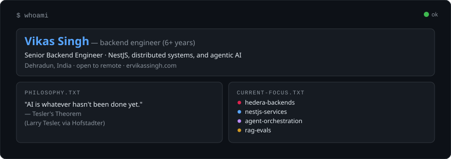
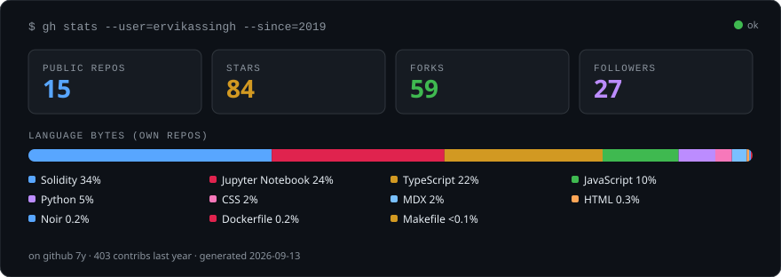
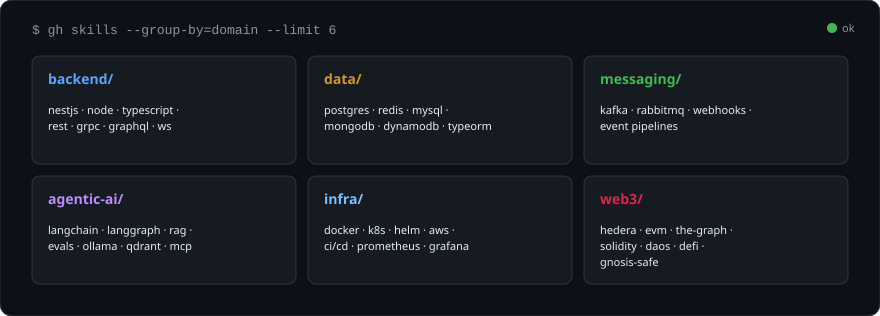
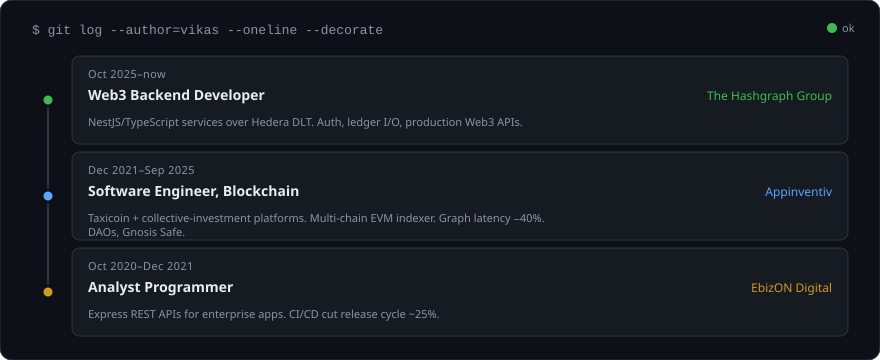
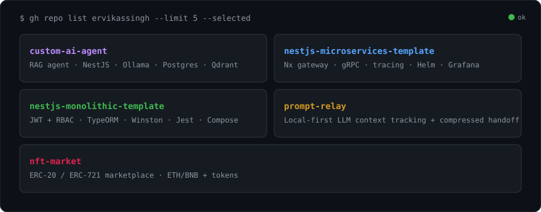
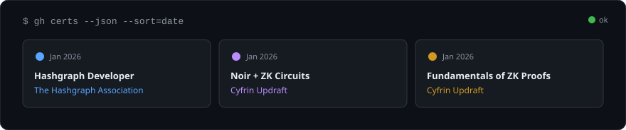

# Vikas Singh

**Senior Backend Engineer** · NestJS, distributed systems, and agentic AI  
Dehradun, India · open to remote · [ervikassingh.com](https://ervikassingh.com)

  

---

### Stats

Generated in this repo from the GitHub API (refreshed weekly). No trophy or streak widgets.

  

---

### Stack

  

---

### Log

  

---

### Selected work

  

[custom-ai-agent](https://github.com/ervikassingh/custom-ai-agent) ·
[nestjs-microservices-template](https://github.com/ervikassingh/nestjs-microservices-template) ·
[nestjs-monolithic-template](https://github.com/ervikassingh/nestjs-monolithic-template) ·
[prompt-relay](https://github.com/ervikassingh/prompt-relay-landing) ·
[nft-market](https://github.com/ervikassingh/nft-market)

---

### Certs

  

---

**[`→ email`](mailto:mail.ervikassingh@gmail.com)** · **[`→ portfolio`](https://ervikassingh.com)** · **[`→ linkedin`](https://linkedin.com/in/ervikassingh)** · **[`→ x`](https://x.com/wiekkii)**
